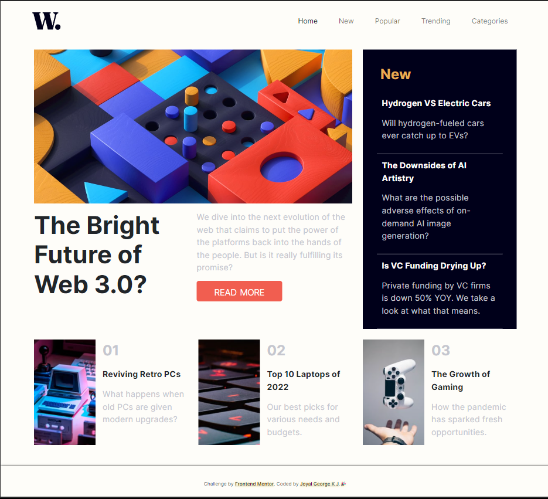

# Frontend Mentor - News homepage solution

This is a solution to the [News homepage challenge on Frontend Mentor](https://www.frontendmentor.io/challenges/news-homepage-H6SWTa1MFl). Frontend Mentor challenges help you improve your coding skills by building realistic projects. 

## Table of contents
- [The challenge](#the-challenge)
- [Screenshot](#screenshot)
- [Built with](#built-with)
- [What I learned](#what-i-learned)
- [Useful resources](#useful-resources)
- [Author](#author)
- [Acknowledgments](#acknowledgments)

## The challenge

Users should be able to:

- View the optimal layout for the interface depending on their device's screen size
- See hover and focus states for all interactive elements on the page

## Screenshot

## Built with

- Semantic HTML5 markup
- CSS custom properties
- Flexbox
- CSS Grid
- Bootstrap 5

## What I learned

 - Learned CSS Grid and The nav was really tough at first but now its ok

## Useful resources

- [Grid resource](https://youtu.be/rg7Fvvl3taU?si=FnAVufIlk8qFUb8L) - This helped me for Grid Layout. I really liked this pattern and will use it going forward.
- [Nav Toggle resource](https://youtu.be/HbBMp6yUXO0?si=HIpN-pzihg4RP0Zk) - This is an amazing article which helped me finally understand Nav Toggle. I'd recommend it to anyone still learning this concept.

## Author

- Frontend Mentor - [@Joyal-George-KJ](https://www.frontendmentor.io/profile/Joyal-George-KJ)
- Twitter - [@JoyalGeorgeKJ](https://www.twitter.com/JoyalGeorgeKJ)

## Acknowledgments

I love doing FrontEnd Stuff and this was really nice to do, you will learn/understand the concept of grid with this challenge
